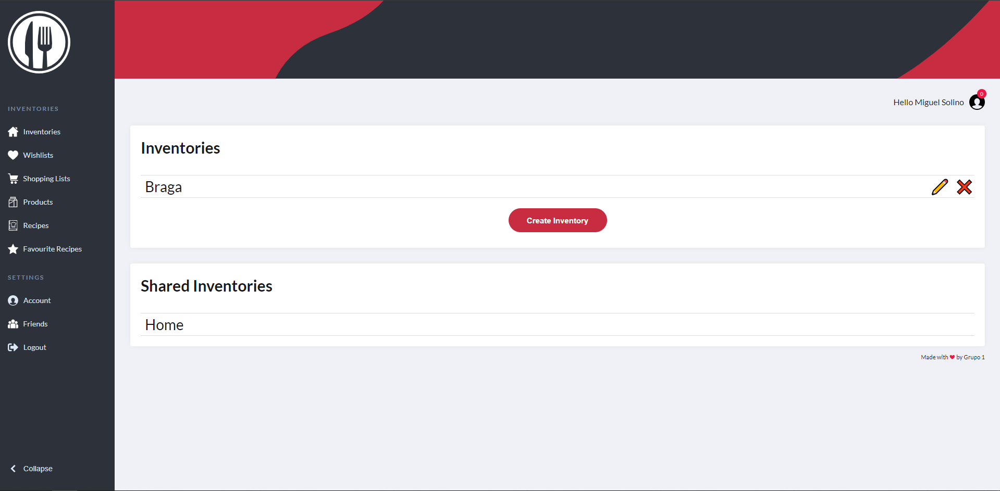
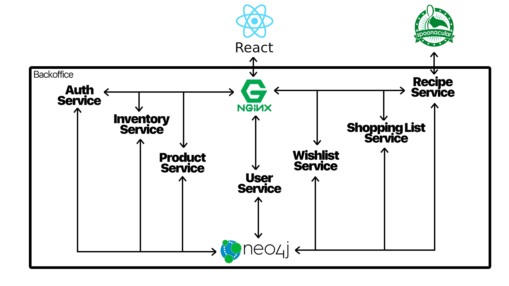

<p align="center">
    
</p>

# Kitchen App
Pantry Managment system with [Spoonacular](https://spoonacular.com/) integration created with ASP.NET and React.js framework and deployed with Docker (Informatic Labs IV assignment @ UMinho)

## Set-up
```bash
docker-compose up
```

## Interface


## Arquitecture


## Documentation
Click [here](KitchenApp) to see the endpoint documentation

## Authors
* [João Teixeira](https://github.com/jtexeira)
* [José Filipe de Sousa Matos Ferreira](https://github.com/JoseFilipeFerreira)
* [Maria Silva](https://github.com/msilva99)
* [Miguel André da Silva Solino](https://github.com/Manilator)
* [Pedro Oliveira](https://github.com/pedromgdo)

## License
This project is licensed under the MIT License - see the [LICENSE](LICENSE) file for details
